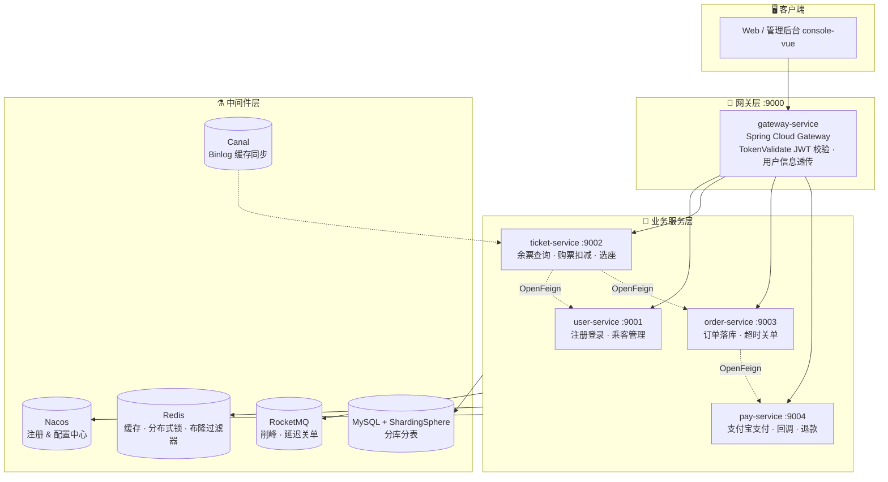
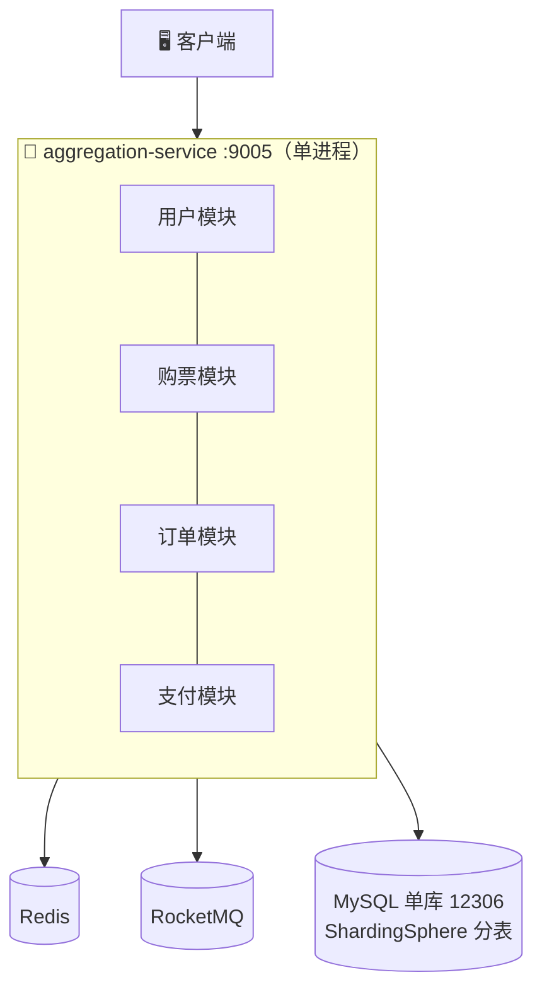
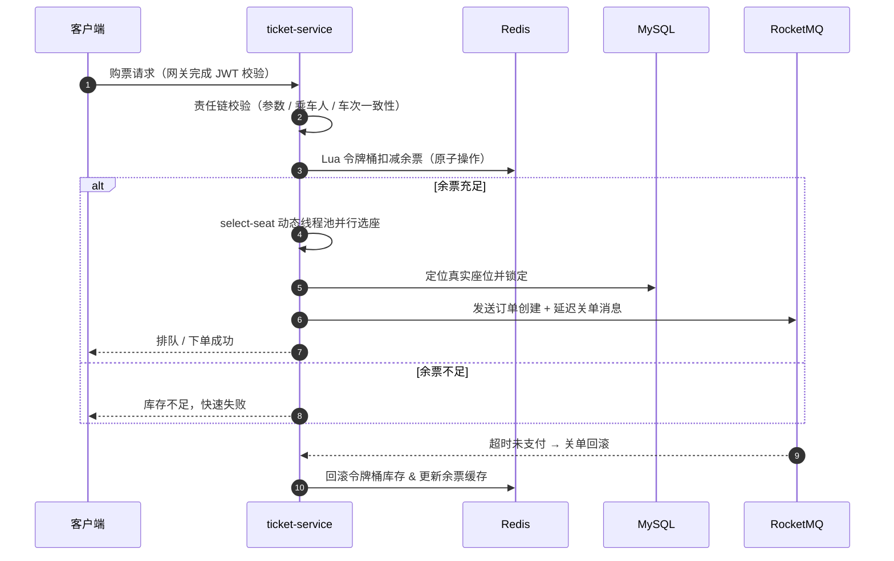

<div align="center">

# 🚄 12306 铁路购票系统

**一款面向高并发场景、支持双架构形态（单体聚合 / 微服务）的分布式购票学习项目**

SpringBoot3 + Java17 + SpringCloud Alibaba + RocketMQ + ShardingSphere + Redis

[](https://www.oracle.com/java/)
[](https://spring.io/projects/spring-boot)
[](https://spring.io/projects/spring-cloud)
[](https://github.com/alibaba/spring-cloud-alibaba)
[](https://www.mysql.com/)
[](https://redis.io/)
[](https://rocketmq.apache.org/)
[](./LICENSE)

**用户 · 购票 · 订单 · 支付四大领域服务 | 自研中间件框架 | 海量数据分库分表 | 亿级流量高并发设计**

[快速开始](#-快速开始) · [双版本说明](#-双版本架构) · [技术亮点](#-核心技术亮点) · [项目结构](#-项目结构)

</div>

---

## 📖 项目简介

本项目是对中国铁路 12306 购票业务的**技术重构与高并发场景落地**，覆盖 **用户注册登录、车票查询、余票扣减、选座购票、订单管理、支付宝支付、退票** 等完整业务闭环。

项目最大的特色是提供了**两套可独立运行的架构版本**，一套代码两种形态，非常适合对照学习架构演进：

| | 🧩 聚合版（单体） | ☁️ 微服务版（分布式） |
|---|---|---|
| **启动入口** | `aggregation-service` | `gateway-service` + 4 个业务服务 |
| **进程模型** | 单 JVM 进程，四大业务以依赖形式聚合 | 独立进程，各服务独立部署、独立伸缩 |
| **服务治理** | 无需网关与注册中心 | Nacos 注册/配置中心 + Spring Cloud Gateway 网关 |
| **服务间调用** | 本地方法调用 | OpenFeign（OkHttp）+ Spring Cloud LoadBalancer |
| **数据库布局** | 单库 `12306`，核心表 16 张分表 | 按服务独立分库（如 `12306_user_0/1`），每库 16 张分表 |
| **访问端口** | `9005` 一个端口 | 网关 `9000` 统一入口，业务端口 `9001~9004` |
| **适用场景** | 学习业务逻辑、低成本部署、快速演示 | 学习微服务治理、高并发架构、分布式事务与中间件 |
| **部署复杂度** | ⭐⭐（MySQL + Redis + RocketMQ） | ⭐⭐⭐⭐（额外需要 Nacos，可选 Sentinel / Canal / XXL-Job） |

> 💡 **推荐学习路径**：先用聚合版跑通全流程，吃透业务；再切到微服务版，专注服务治理与高并发组件。

---

## 🏗️ 双版本架构

### ☁️ Spring Cloud 微服务版



### 🧩 Spring Boot 聚合版



---

## ✨ 核心技术亮点

### 🔥 高并发购票链路



- **Lua 脚本令牌桶限流**：余票扣减与回滚均由 Redis Lua 脚本原子完成（`ticket_availability_token_bucket.lua` / `ticket_availability_rollback_token_bucket.lua`），无锁化抵御瞬时抢票洪峰。
- **多级缓存查询**：车次、余票等热点数据采用 **Caffeine 本地缓存 + Redis** 两级缓存，降低数据库压力。
- **Canal Binlog 缓存同步**：监听 MySQL binlog，数据变更后精准更新/回滚余票缓存，保证缓存最终一致性。
- **动态线程池选座**：基于 **Hippo4j** 的 `select-seat-thread-pool-executor` 执行选座算法，线程池参数可经 Nacos 动态调整。
- **延迟消息关单**：RocketMQ 延迟消息实现"N 分钟未支付自动关单 + 库存回滚"。
- **分布式ID**：雪花算法（Redis 注册 WorkerId）+ 号段模式双方案，适配不同业务表。

### 🧱 自研中间件框架（frameworks）

| 模块 | 能力 |
|---|---|
| `convention` | 全局返回规约 `Results`、业务异常体系、错误码 |
| `web` | 全局异常处理、Web 容器通用配置 |
| `cache` | `StringRedisTemplateProxy` 缓存代理、**多级缓存**、**布隆过滤器**防穿透、Redisson **分布式锁** |
| `idempotent` | 注解式幂等：`@RestAPIIdempotent`（Token / Param / SpEL 三种策略）+ `@MQIdempotent` 消费幂等 |
| `distributedid` | 雪花算法（随机 / Redis 两种 WorkerId 选取策略）+ 号段模式 ID 生成器 |
| `database` | MyBatis-Plus + ShardingSphere 分库分表封装 |
| `designpattern` | 抽象**策略模式、责任链、模板方法**脚手架（购票链路大量使用） |
| `bizs/user` | 登录用户上下文透传（网关解析后下游服务直接获取用户信息） |
| `log` / `common` / `base` | 日志埋点、通用工具、基础抽象 |

### 🛡️ 网关与安全

- 自定义 `TokenValidateGatewayFilterFactory`：网关统一完成 **JWT 校验**，解析用户信息并透传下游，业务服务零重复鉴权。
- ShardingSphere **数据加密**：手机号、身份证等敏感字段加密落库，密文查询依旧可用（`t_user_mail_*` / `t_user_phone_*` 密文索引表）。

### 💾 海量数据分库分表

- 以 **用户名** 为分片键，`t_user` / `t_passenger` / `t_order` / `t_order_item` 等核心表水平拆分；
- 微服务版按服务边界拆库（`12306_user_0/1`、`12306_ticket_*`…），聚合版单库分表，**建表 SQL 一键初始化**。

---

## 🧰 技术栈

| 分类 | 技术 |
|---|---|
| **语言 / 基础框架** | Java 17 · Spring Boot 3.0.7 · Spring Cloud 2022.0.3 · Spring Cloud Alibaba 2022.0.0.0-RC2 |
| **微服务治理** | Nacos（注册 & 配置中心）· Spring Cloud Gateway · OpenFeign + OkHttp · Spring Cloud LoadBalancer · Sentinel（限流熔断） |
| **数据存储** | MySQL 8.0 · MyBatis-Plus 3.5.3 · **ShardingSphere 5.3.2（分库分表 + 数据加密）** |
| **缓存 & 锁** | Redis · Redisson 3.21 · Caffeine（多级缓存）· 布隆过滤器 · Lua 脚本令牌桶 |
| **消息队列** | RocketMQ 5.x（削峰填谷 · 延迟消息 · 事务消息） |
| **任务 & 同步** | XXL-Job（分布式调度）· Canal（Binlog 监听） |
| **监控运维** | Spring Boot Actuator · Micrometer + Prometheus 指标 · Hippo4j 动态线程池 |
| **支付** | 支付宝沙箱支付（策略模式渠道/回调） |
| **认证 & 工具** | JWT (jjwt) · fastjson2 · Hutool · Guava · Lombok · Spotless + CheckStyle 代码规约 |

---

## 📁 项目结构

```
12306
├── dependencies                    # 📦 依赖版本管理（Maven BOM）
├── frameworks                      # 🧱 自研中间件框架
│   ├── convention                  #    全局规约：统一返回、异常、错误码
│   ├── common / base               #    通用工具 & 基础抽象
│   ├── web                         #    Web 全局配置、异常处理
│   ├── cache                       #    多级缓存、布隆过滤器、分布式锁
│   ├── database                    #    MyBatis-Plus + ShardingSphere 封装
│   ├── distributedid               #    分布式 ID：雪花算法 + 号段模式
│   ├── idempotent                  #    注解式幂等框架（接口 & MQ）
│   ├── designpattern               #    策略 / 责任链 / 模板方法脚手架
│   ├── log                         #    日志
│   └── bizs/user                   #    用户登录上下文
├── services                        # 🔧 业务服务
│   ├── aggregation-service         # 🧩 聚合版启动器（:9005）
│   ├── gateway-service             # ☁️ 网关（:9000，JWT 校验 + 路由）
│   ├── user-service                #    用户服务（:9001）
│   ├── ticket-service              #    购票服务（:9002）
│   ├── order-service               #    订单服务（:9003）
│   └── pay-service                 #    支付服务（:9004）
├── console-vue                     # 🖥️ 管理后台前端（Vue2 + Element UI）
├── resources
│   ├── db                          #    建表语句（springboot / springcloud 两套）
│   └── data                        #    初始化数据
├── tests                           # 🧪 测试
├── checkstyle / format             # 代码规约 & 格式化
└── pom.xml
```

<details>
<summary><b>📂 各服务核心包一览（点击展开）</b></summary>

```
user-service
├── controller        UserLoginController（注册/登录/登出/注销）
│                     UserInfoController · PassengerController（乘车人 CRUD）
└── service/handler   用户名/邮箱/手机号多种登录方式策略

ticket-service
├── controller        TicketController（购票/列表/取消）
│                     RegionStationController · TrainStationController
├── service/cache     余票缓存策略
├── service/handler/ticket
│   ├── filter        购票/查询/退单三大责任链过滤器
│   ├── select        TrainSeatTypeSelector 选座算法
│   └── tokenbucket   令牌桶限流
├── canal             Binlog 变更 → 余票缓存更新 / 关单回滚
├── mq                RocketMQ 生产/消费（延迟关单等）
├── job               XXL-Job 定时任务
└── remote            OpenFeign 远程调用（用户/订单服务）

order-service         订单创建/查询/分页/取消 · 分库分表 · 延迟关单
pay-service           支付策略 · 支付宝回调 · 退款
gateway-service       路由转发 · TokenValidateGatewayFilterFactory
```

</details>

---

## 🚀 快速开始

### 0️⃣ 环境准备

| 组件 | 要求 | 聚合版 | 微服务版 | 默认地址（账号/密码） |
|---|---|:---:|:---:|---|
| JDK | 17+ | ✅ | ✅ | — |
| Maven | 3.6+ | ✅ | ✅ | — |
| MySQL | 8.0 | ✅ | ✅ | `127.0.0.1:3306`（root/root） |
| Redis | 6.0+ | ✅ | ✅ | `127.0.0.1:6379`（密码 `123456`） |
| RocketMQ | 5.x / 4.9 | ✅ | ✅ | `127.0.0.1:9876` |
| Nacos | 2.x | ➖ | ✅ | `127.0.0.1:8848`（nacos/nacos） |
| Sentinel Dashboard | 1.8 | ➖ | 可选 | `localhost:8686` |
| Canal / XXL-Job-Admin / Hippo4j | — | ➖ | 可选 | 缓存同步 / 调度 / 动态线程池增强 |

### 1️⃣ 初始化数据库

```sql
-- 🧩 聚合版：单库 12306
CREATE DATABASE `12306` DEFAULT CHARACTER SET utf8mb4;
```
```bash
# 执行建表 + 初始化数据
mysql -uroot -p 12306 < resources/db/12306-springboot.sql
mysql -uroot -p 12306 < resources/data/12306-springboot.sql
```

```sql
-- ☁️ 微服务版：按服务建库（建表语句内含分库分表所需的全部真实表）
-- 12306_user_0 / 12306_user_1 / 12306_ticket_* / 12306_order_* / 12306_pay_*
```
```bash
for svc in user ticket order pay; do
  mysql -uroot -p < resources/db/12306-springcloud-${svc}.sql
done
# 初始化种子数据（ticket / user）
mysql -uroot -p < resources/data/12306-springcloud-user.sql
mysql -uroot -p < resources/data/12306-springcloud-ticket.sql
```

### 2️⃣ 修改配置

中间件连接信息分布在各服务 `application.yaml` 及 `shardingsphere-config*.yaml` 中，默认值见上表；不一致时请按需修改（MySQL 账号、Redis 密码等）。

### 3️⃣ 编译

```bash
mvn clean install -DskipTests
```

### 4️⃣ 启动

<details open>
<summary><b>🧩 方式一：聚合版（推荐先跑通业务）</b></summary>

```bash
# 启动 AggregationServiceApplication，或：
java -jar services/aggregation-service/target/index12306-aggregation-service.jar
```
✅ 服务地址：`http://127.0.0.1:9005`，四大业务接口按 `/api/{user|ticket|order|pay}-service/**` 直连访问。

</details>

<details>
<summary><b>☁️ 方式二：微服务版</b></summary>

```bash
# 先确保 Nacos 已启动，然后依次启动：
# GatewayServiceApplication → UserServiceApplication → TicketServiceApplication
# → OrderServiceApplication → PayServiceApplication
```
✅ 统一入口：`http://127.0.0.1:9000`（网关负载均衡转发，无需关心后端端口）。

</details>

<details>
<summary><b>🖥️ 管理后台（可选）</b></summary>

```bash
cd console-vue
yarn install
yarn serve
```

</details>

### 5️⃣ 体验核心链路

1. `POST /api/user-service/v1/register` 注册 → `/v1/login` 登录获取 Token；
2. `GET /api/ticket-service/ticket/query?...` 查询余票（多级缓存生效）；
3. `POST /api/ticket-service/ticket/purchase` 抢票下单（令牌桶扣减 + 责任链 + 选座）；
4. `POST /api/pay-service/pay` 沙箱支付 → 回调落库 → 超时未支付自动关单回滚；
5. `POST /api/ticket-service/ticket/cancel` 退票，观察库存回滚与 Canal 缓存同步。

---

## 🧪 工程质量

- **Spotless**：统一代码格式 + 版权头，编译期自动格式化；
- **CheckStyle**：代码规约静态检查（`checkstyle/12306_checkstyle.xml`）;
- **Actuator + Prometheus**：各服务暴露 `micrometer` 指标，可对接 Grafana 监控大盘；
- **单元 / 集成测试**：`tests/general` 提供跨模块测试用例。

---

## 🗺️ 学习路线建议

```
① frameworks/convention + web        → 吃透统一返回与异常体系
② user-service                        → 分布式 ID、布隆过滤器、数据加密、JWT 登录
③ ticket-service 查询链路             → 多级缓存、缓存一致性（Canal）
④ ticket-service 购票链路             → 责任链、Lua 令牌桶、动态线程池选座
⑤ order-service + pay-service         → 分库分表、延迟消息关单、策略模式支付
⑥ 切换微服务版                        → 网关鉴权、Feign 调用、Nacos 治理、Sentinel
```

---

## 🤝 致谢

本项目源自 openGoofy（拿个offer）社区开源项目 [nageoffer/12306](https://github.com/nageoffer/12306)，感谢 @马丁 及社区贡献者的开源精神。本项目遵循 [Apache License 2.0](./LICENSE) 协议。

<div align="center">

**如果这个项目对你有帮助，欢迎 Star ⭐ 支持！**

</div>
