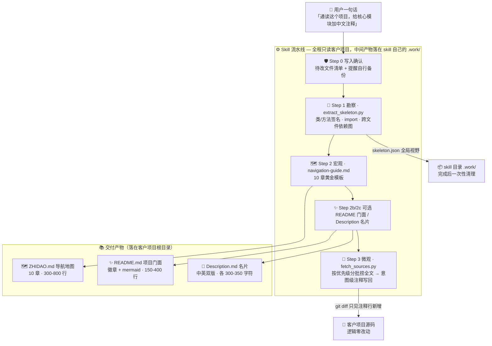

<div align="center">

# 📖 Code-Explain-Expert

**让 AI 通读你的整个代码库，生成项目地图，再批量为每处代码写下「意图级」注释**

*Skeleton-first Navigation · Intent-level Comments · Zero Logic Changes*

[](https://www.python.org/)
[]()
[]()
[]()
[]()
[](./LICENSE)

[快速开始](#-快速开始) · [效果对比](#-效果对比流水账-vs-意图级) · [架构总览](#️-架构总览) · [安全红线](#️-客户项目保护红线) · [版本演进](#-版本演进)

</div>

---

> ### 💭 它不重构你的代码，它让代码开口说话
>
> 接手一个几十万行的遗留仓库：不知道从哪读起，单看一个文件不知道它为什么存在，隐藏的坑全靠踩。**Code-Explain-Expert 用「先宏观后微观」两步解决**——先扫全仓骨架画出项目地图（ZHIDAO.md），再带着全局视野分批写下意图级注释，让读代码像看一本带批注和地图的实体书。
>
> *It reads through your whole codebase, draws the map, and annotates the book — without changing a single line of logic.*

---

## ✨ 三大设计支柱

|                                                    🗺️ 先宏观，后微观                                                    |                                                  📝 意图级，不流水账                                                   |                                                     🛡️ 零风险红线                                                     |
| :---------------------------------------------------------------------------------------------------------------------: | :-------------------------------------------------------------------------------------------------------------------: | :-------------------------------------------------------------------------------------------------------------------: |
| 不一头扎进 15 万行源码。先只扫全仓骨架（签名 / 依赖，不含实现）获得全局视野，生成 `ZHIDAO.md` 项目地图，再按优先级分批下注释——**像先看地图再进城**。 | 每条注释必须回答「为什么存在 / 解决什么业务问题 / 有什么坑」；已有注释与英文 docstring 一律保留；读不懂就标 `// 待确认`，**绝不编故事**。 | 只加注释不改逻辑，写入前必先给待改清单等确认；**不碰 git 写操作、不污染项目目录、不上传任何远端**——每一条都写进验证清单可自查。 |

## 🚀 功能全景

- 🦴 **14 语言骨架提取** — `scripts/extract_skeleton.py`：Java / Python / JS / TS / Go… 类与方法签名、import、跨文件依赖图；Python 用 `ast` 编译器级解析，不做正则猜测
- 🗺️ **ZHIDAO.md 项目地图** — `references/navigation-guide.md` 10 章黄金模板：技术栈、目录树、模块职责、依赖流向、推荐阅读路径
- ✨ **README 黄金门面** — `references/readme-guide.md`：徽章 + mermaid 架构图 + 折叠收纳，150-400 行；产品型 / 学习型双黄金样例对照，风格不跑偏
- 📇 **Description 中英名片** — 中英双版各 300-350 字符、4 句话结构，直接可贴 GitHub About
- 📝 **意图级批量注释** — 按 `references/comment-style-guide.md` 用户黄金风格：拟人化比喻（总导演 / 快递箱 / 哨兵）、双语并存、防编造规则
- 🔗 **链路追踪注释** — 沿 `skeleton.json` 的 `dependency_links` 从 Controller 追到 DB，只注释链路节点，不浪费一次注释
- 💡 **优先级决策** — 出度高的入口文件先注、被依赖多的核心先注；测试 / 配置 / 静态资源自动跳过
- 🧩 **超大项目编排** — `scripts/bigfile_split.py` 800 行/块、40 行重叠切块；仓库超 50 文件自动分批，每轮只处理 3-5 个
- 🏆 **黄金案例库** — 注释两套：`Gewu-Deep-Research/`（Agent 编排型）+ `Code-Probe/`（业务服务型）；README 两套：产品型 + 学习型；导航一套：完整 10 章样例
- 🛡️ **六条安全红线** — v4.0 因真实事故加固，见[下文](#️-客户项目保护红线)，违反即事故

## 📝 效果对比：流水账 vs 意图级

同样的代码，普通 AI 注释 vs 本 Skill 注释：

```java
// ❌ 流水账（普通 AI 注释）——删掉注释，读者信息零损失
// 调用 find 方法查订单
PaymentRecord record = paymentMapper.findByOrderNo(request.getOrderNo());
// 如果 record 为空
if (record == null) {
    // 创建新订单
    return createNewOrder(request);
}
```

```java
// ✅ 意图级（本 Skill 注释）——解释为什么、业务语义、隐藏约束
// 幂等闸门：网关回调可能重试，同单号二次进入直接返回，避免重复扣款
PaymentRecord record = paymentMapper.findByOrderNo(request.getOrderNo());
if (record != null) {
    // 已支付/处理中的订单不允许重复发起，与网关侧 dedup_key 双保险
    return PaymentResult.alreadyPaid();
}
// 先锁后扣：锁定订单防止并发扣款竞态
orderService.lockOrder(request.getOrderNo());
// 网关无补偿接口，扣款失败时订单保持锁定，由对账任务 2h 后解锁
PaymentResult result = paypalGateway.charge(request);
```

|          流水账（❌）          |                       意图级（✅）                       |
| ---------------------------- | ------------------------------------------------------- |
| `// 调用 pay`                | `// 幂等闸门：同单号二次进入直接返回，防网关回调重试重复扣款` |
| `// 设置状态为已支付`         | `// 状态: PAYING -> PAID；仅支付成功回调可触发，先校验当前态` |
| `// 遍历列表`                | `// 逆序遍历：后创建的任务优先处理（LIFO，与调度器契约一致）` |
| `// 获取用户信息`            | `// 从 Token 解析用户而非查库：SSO 会话优先，DB 仅作缓存兜底` |

除了严谨的意图级注释，还有用户认可的**黄金风格**加成——拟人化比喻降低理解门槛：

```python
# clarify_with_user（向用户澄清）：整个流程的"开门把关"。用户一句话可能很模糊，
# 这里让 Agent 判断"要不要先问清楚再开工"。如果配置里禁用了追问，就直接溜去写调研提纲
async def clarify_with_user(state, config) -> ...:
    """Analyze user messages..."""  # ← 原英文 docstring 保留，不删不改
```

> 🏆 以上正反例与黄金风格全部沉淀在 `references/comment-style-guide.md` 与两套黄金样例源码中，风格把握不准时随时对照。

## 🏗️ 架构总览



**技术栈**：纯 Python 标准库（ast / pathlib / json）· 零 pip 依赖 · 3 个确定性脚本 · 兼容 55+ Agent 运行时（Claude Code / Codex / Cursor / OpenClaw / Gemini CLI / OpenCode / CodeBuddy / Hermes / Workbuddy…）

---

## 🚀 快速开始

### 环境要求

| 组件      | 要求                                                        | 说明                       |
| --------- | ----------------------------------------------------------- | -------------------------- |
| Agent 运行时 | Claude Code / Codex / Cursor / OpenClaw / Gemini CLI 等，任选其一 | Skill 本体是 Markdown，运行时负责执行 |
| Python    | 3.8+                                                        | 仅 3 个勘察脚本用到         |
| 依赖安装  | 无                                                          | 纯标准库，`pip install` 都不需要 |

### 1️⃣ 一句话安装

打开你正在用的 agent，直接告诉它：

```
帮我安装这个 skill：https://github.com/WeatherCore/Code-Explain-Expert
```

### 2️⃣ 通用 CLI 安装（55+ runtime）

```bash
npx skills add WeatherCore/Code-Explain-Expert
# 需要指定运行时时：-a claude-code / -a codex / -a cursor / -a openclaw
```

### 3️⃣ 体验核心链路（五大场景任选）

| 场景          | 你怎么说                                                     | Skill 做什么                                          |
| ------------- | ------------------------------------------------------------ | ----------------------------------------------------- |
| A 全量填充    | 「通读这个项目，给核心业务模块加上中文业务注释」             | 勘察 → 生成 ZHIDAO.md → 分批注释全仓                  |
| B 定向攻坚    | 「把 payment 包下所有类深度注释一遍」                        | 只扫目标目录 → 直接注释                               |
| C 链路追踪    | 「追踪用户下单接口从 Controller 到 DB 的完整调用链并加注释」 | 沿 dependency_links 追踪 → 只注释链路节点             |
| D README      | 「帮我给这个项目写个 README」                                | 勘察 → 按黄金门面模板生成/更新 README（已有绝不覆盖） |
| E Description | 「帮我写个项目简介 / Description」                           | 勘察 → 生成中英双版 Description.md                    |

无论哪个场景，**写入前都会先给你待改文件清单 + 自行备份提醒，你确认后才动笔**。

<details>
<summary><b>🚫 什么时候不会触发</b>（走普通问答，点击展开）</summary>

- 单段代码讲解（无完整项目结构）
- 代码重构 / 改业务实现
- 运行故障修复 / 调试
- 多项目对比 / 技术选型

</details>

## 🛡️ 客户项目保护红线

v3 曾发生「客户项目被误传远端仓库」事故，v4.0 因此全面加固。以下六条写入 SKILL.md 验证清单，**违反即事故**：

| # | 红线                 | 具体约束                                                                                                  |
| - | -------------------- | --------------------------------------------------------------------------------------------------------- |
| 1 | 不执行任何 git 写操作 | commit / push / stash / branch / checkout / tag / reset / add / merge / rebase 一律禁止，只允许只读查询   |
| 2 | 不污染客户项目目录   | `.bak` / `skeleton.json` / `chunks.json` 等中间文件全部落 skill 目录 `.work/`，完成后清理                 |
| 3 | 不上传任何远端       | GitHub / GitLab / Gitee / 内部 Git / 网盘 / 对象存储，一个都不碰                                          |
| 4 | 不替用户做备份决策   | 备份与版本控制由用户自己负责，skill 只告知待改清单 + 提醒「请自行备份」                                   |
| 5 | 回滚由用户主导       | 只提示命令（`git checkout -- <files>` / `git restore <files>`），绝不代为执行                             |
| 6 | 已有文档绝不覆盖     | 已有 README / Description 保持原样（除非用户明确要求重写），更新模式只补缺失章节并标记 `<!-- CC: 新增 -->` |

## 📁 项目结构

```
Code-Explain-Expert/
├── Code-Comment-Expert-v1.0/     # 🗄️ 归档：首版（Java/Python 双语言 + 备份护栏）
├── Code-Comment-Expert-v2.0/     # 🗄️ 归档：14 语言骨架 + 依赖图 + 黄金风格
├── Code-Explain-Expert-v3.0/     # 🗄️ 归档：工程补强找回 + 9 bug 修复
├── Code-Explain-Expert-v4.0/     # ✅ 正式版：实际使用只用这个
│   ├── SKILL.md                  # 🧠 控制层：触发 / 决策树 / 红线 / 验证清单
│   ├── scripts/                  # 🦴 3 个确定性脚本（纯标准库，零依赖）
│   ├── references/               # 📚 7 份规范 + 黄金样例库
│   └── tests/                    # 🧪 冒烟测试 24 项 + fixtures 最小工程
├── LICENSE                       # 📜 MIT
└── README.md                     # 📄 你正在看的这份
```

<details>
<summary><b>📁 v4.0 完整目录结构</b>（点击展开）</summary>

```
Code-Explain-Expert-v4.0/
├── SKILL.md                      # 控制层：触发/工作流/决策树/红线/验证/资源
├── agents/openai.yaml            # OpenAI agent 路由配置
├── scripts/                      # 3 个确定性脚本（零外部依赖，纯标准库）
│   ├── extract_skeleton.py       #   骨架提取（14 语言，Python 用 ast 精准解析）
│   ├── fetch_sources.py          #   按优先级分批捞取完整源码
│   └── bigfile_split.py          #   超大文件行级切块（800 行/块、40 行重叠）
├── references/                   # 按需加载的规范与样例
│   ├── navigation-guide.md       #   ZHIDAO.md 10 章黄金模板 + 验收清单
│   ├── readme-guide.md           #   README 黄金门面模板（徽章/mermaid/折叠，150-400 行）+ 绝不覆盖策略
│   ├── description-guide.md      #   Description 中英双版各 300-350 字符规范
│   ├── comment-style-guide.md    #   意图级注释规范 + 正反例 + 防编造规则
│   ├── language-adaptation.md    #   14 语言注释语法
│   ├── orchestration-guide.md    #   流水线细节 + 批处理策略 + 失败排查表
│   ├── limitations.md            #   已知限制（诚实记录）
│   └── samples/                  #   用户认可的黄金样例（风格把握不准时对照）
│       ├── ZHIDAO.md             #   完整 10 章导航样例
│       ├── Gewu-Deep-Research/   #   意图级注释黄金样例 · Agent 编排型
│       ├── Code-Probe/           #   意图级注释黄金样例 · 业务服务型（services 层 5 文件全注释）
│       └── README/               #   README 黄金门面样例：README1 产品型 / README2 学习型
└── tests/                        # 冒烟测试 + fixtures + 样例输出
    ├── test_smoke.py             #   三脚本可执行性 + 客户项目零污染 + .work/ 生命周期
    ├── fixtures/                 #   sample-java + sample-py 最小工程
    └── out/ZHIDAO.example.md     #   10 章黄金模板示例输出
```

</details>

> 完整工作流、决策树与验证清单的逐条导读，见 [Code-Explain-Expert-v4.0/SKILL.md](./Code-Explain-Expert-v4.0/SKILL.md)。

## 📈 版本演进

| 版本                           | 状态            | 关键变化                                                                                                        |
| ------------------------------ | --------------- | --------------------------------------------------------------------------------------------------------------- |
| `Code-Comment-Expert-v1.0`     | 🗄️ 归档（可对比） | Java/Python 双语言、备份护栏、hash 兜底；但缺决策树/验证，无黄金样例                                             |
| `Code-Comment-Expert-v2.0`     | 🗄️ 归档（可对比） | 14 语言骨架、依赖图、黄金风格样例；但丢失 v1 备份护栏，Python 解析退化为正则                                      |
| `Code-Explain-Expert-v3.0`     | 🗄️ 归档（可对比） | 找回 v1 全部 5 处工程补强，修复 v2 的 9 个 bug，新增 `limitations.md`                                            |
| **`Code-Explain-Expert-v4.0`** | ✅ **正式版**    | 事故后安全加固（六条红线）；三产物（ZHIDAO/README/Description）；五场景；黄金案例双倍扩容（注释两套 + README 两套）；冒烟 24/24 |

> v1.0 / v2.0 / v3.0 保留仅作版本对比与演进参考，实际使用请用 v4.0。

<details>
<summary><b>🧪 验证与质量</b>（点击展开）</summary>

- **结构性校验**：`review_skill.py` 版本实测——v1.0 = 2 high / 3 medium，v2.0 = 0/0/0，v3.0 = 0/0/0，v4.0 = **0/0/0**
- **冒烟测试**：`python tests/test_smoke.py` 实测 **24 passed / 0 failed**，覆盖三脚本可执行性、客户项目零污染、`.work/` 生命周期
- **脚本端到端**：在 `tests/fixtures/` 上跑通（Java 3 文件 2 依赖边；Python 2 文件 1 依赖边，测试文件正确跳过）
- **Python 解析精度**：用 `ast`（编译器级）替代正则，在黄金样例上精准识别类与跨文件依赖

</details>

<details>
<summary><b>⚠️ 已知限制</b>（诚实记录，点击展开）</summary>

骨架提取为结构推断（依赖图为启发式匹配，非精确调用图）；Java 泛型/Lombok/内部类、JS 箭头函数、动态分发/反射调用等无法 100% 精确。完整清单见 `references/limitations.md`。

</details>

## 🗺️ Roadmap

- [x] v1.0 双语言注释 + 备份护栏 + hash 兜底
- [x] v2.0 14 语言骨架 + 依赖图 + 黄金风格样例
- [x] v3.0 找回全部工程补强 + 修复 9 bug + 已知限制清单
- [x] v4.0 六条安全红线 + 三产物 + 五场景 + 冒烟测试 24 项
- [x] v4.0+ 黄金案例双倍扩容 + README 黄金门面模板（本 README 即按该模板重写）
- [ ] 更多语言编译器级骨架解析（Rust / Kotlin / C#）
- [ ] 注释语言可选英文输出

---

<div align="center">

## 🤝 参与贡献

**Fork → Branch → PR**，欢迎提交新语言支持、新黄金样例与规范改进！

📜 本项目基于 [MIT License](./LICENSE) 开源 © 2026 Weather-Report

**如果这个 Skill 帮你读懂了一个陌生仓库，欢迎点一个 ⭐ Star，让下一个接手遗留项目的人少踩一天坑**

</div>
